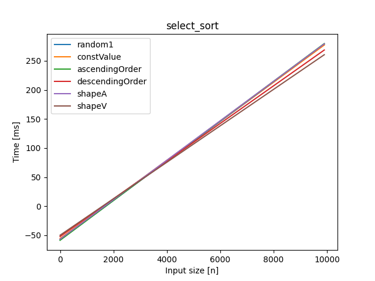
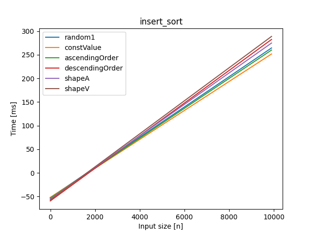
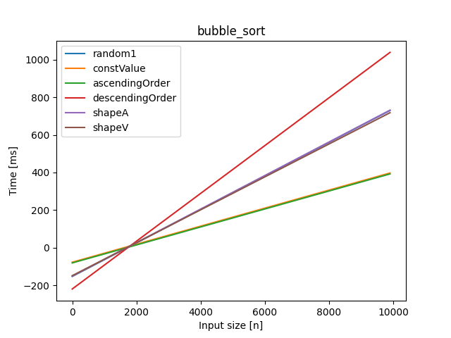
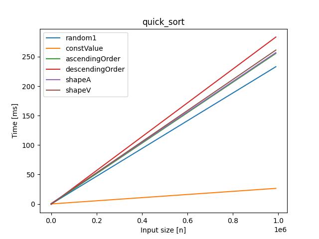
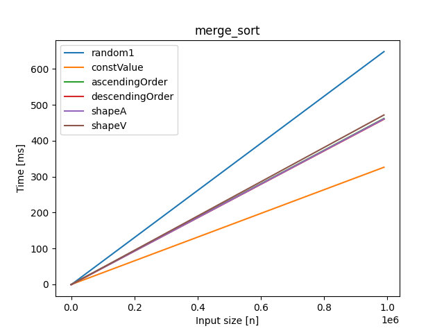
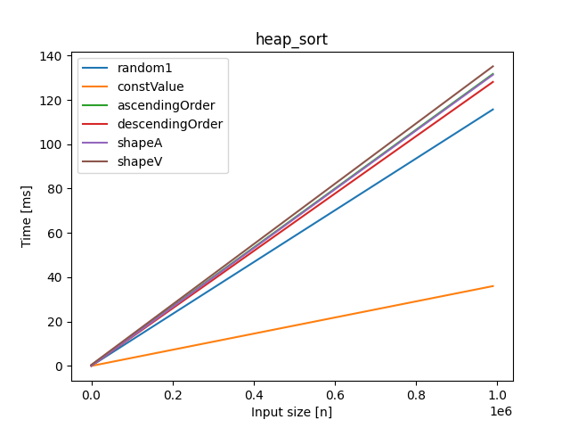
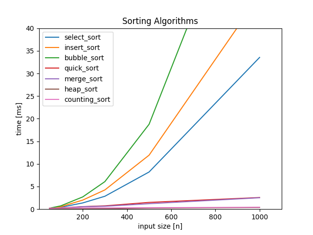

# AiSD
Sprawozdania Algorytmy i Struktury Danych, PUT Informatyka, semestr II


Politechnika Poznańska
Informatyka, semestr II
Algorytmy i Struktury Danych
Michał Zieliński 
INF5.1 148064

##### Table of Contents  
[1. Algorytmy sortowania](#Algorytmy Sortowania)  
<a name="Algorytmy Sortowania"/>
[1.1 Selection Sort](#Selection Sort)
<a name ="Selection Sort"/>

[1.2 Insertion Sort](#Insertion Sort)
<a name ="Insertion Sort"/>

[1.3 Bubble Sort](#Bubble Sort)
<a name ="Bubble Sort"/>

[1.4 Quick Sort](#Quick Sort)
<a name ="Quick Sort"/>

[1.5 Merge Sort](#Merge Sort)
<a name ="Merge Sort"/>

[1.6 Heap Sort](#Heap Sort)
<a name ="Heap Sort"/>

[1.7 Counting Sort](#Counting Sort)
<a name ="Counting Sort"/>
## Algorytmy Sortowania

Cel sprawozdania:
zaimplementowanie podstawowych algorytmów sortowania w języku Python
porównanie czasu wykonania algorytmów dla różnych typów danych wejściowych
przetestowanie algorytmów
porównanie złożoności czasowej algorytmów

Algorytmy:

<tr>
<li>
Selection Sort
</li>
<li>
Insertion Sort
</li>
<li>
Bubble Sort
</li>
<li>
Quick Sort
</li>
<li>
Merge Sort
</li>
<li>
Heap Sort
</li>
<li>
Counting Sort
</li>
</tr>

Algorytmy sprawdzam dla danych:
<tr>
<li>
losowych (3 razy)
</li>
<li>
wartości stałej
</li>
<li>
posortowanych rosnąco
</li>
<li>
posortowanych malejąco
</li>
<li>
w kształcie A
</li>
<li>
w kształcie V
</li>
</tr>

####Selection Sort
####Opis:

Algorytm przegląda tablicę n razy i za każdym razem umieszcza najmniejszy element na początku. Sortowanie w miejscu. Algorytm niestabilny. Złożoność czasowa O(n^2), gdyż w każdym przypadku wykonują się dwie zagnieżdżone pętle.

####Porównanie złożoności dla różnego typu danych:



####Wnioski:

Dla wszystkich typów danych otrzymujemy podobny czas sortowania. W każdym przypadku algorytm przechodzi przez dwie pętle.

####Własne spostrzeżenia:

intuicyjny w implementacji algorytm, niestety bardzo wolny

####Insertion Sort

####Opis:

Algorytm wstawia kolejne elementy zbioru nieposortowanego na odpowiednie miejsce w zbiorze posortowanym. Sortowanie w miejscu. Algorytm stabilny.Złożoność czasowa O(n^2), gdyż w każdym przypadku wykonują się dwie zagnieżdżone pętle.

####Porównanie złożoności dla różnego typu danych:



####Wnioski:

Znowu otrzymaliśmy podobne wyniki dla wszystkich typów danych wejściowych.

####Własne spostrzeżenia:

intuicyjny w implementacji algorytm, niestety bardzo wolny

####Bubble Sort

####Opis:

Algorytm przechodzi po kolejnych indeksach tablicy. Porównuje dwa sąsiednie elementy i zamienia jeśli są w złej kolejności. Sortowanie w miejscu. Algorytm stabilny. Średnia i pesymistyczna złożoność czasowa to O(n^2), a optymistyczna O(n), gdy dane są posortowane.

####Porównanie złożoności dla różnego typu danych:



####Wnioski:

Otrzymujemy podobne wyniki dla wszystkich typów testów. Najgorszy wynik otrzymujemy dla danych posortowanych malejąco, gdyż bąbelek zawsze przechodzi do końca tabeli.
Dla danych posortowanych złożoność czasowa jest najlepsza.

####Własne spostrzeżenia:

ten algorytm jest już bardziej optymalny dla pewnych typów danych niż dwaj poprzednicy

####Quick Sort

####Opis:

Podejście dziel i zwyciężaj. Algorytm wybiera pivot jako losowy element z tablicy i dzieli ją na dwie podtablice. W pierwszej umieszczamy elementy większe od pivota, a w drugiej mniejsze. Wywołujemy algorytm rekurencyjnie na podtablicach aż do momentu, gdy długość tablicy będzie mniejsza bądź równa 1. Najgorsza złożoność występuje, gdy zawsze wybieramy skrajną (maksymalną, bądź minimalną) wartość jako pivot. Wynosi O(n^2). Optymistyczna złożoność czasowa O(n) występuje, gdy zawsze wybieramy medianę jako pivot. A średnia złożoność czasowa wynosi O(n*logn)

####Porównanie złożoności dla różnego typu danych:



####Wnioski:

Podobny czas dla wszystkich testów, gdyż w algorytmie wybieramy losowo pivota, a testy tego nie uwzględniają. Zdecydowanie najlepiej wypadają wartości stałe gdyż nie wchodzą one do wywołań rekurencyjnych.

#####Własne spostrzeżenia:
algorytm wyraźnie szybszy od naiwnych, jednak jego implementacja jest odrobinę bardziej skomplikowana; napotkałem na problemy z implementacją tego algorytmu, by działał w miejscu. Dla danych do 1mln nie zauważyłem przez to spadków wydajności. Tworząc podtablice z wartościami mniejszymi, większymi i równymi pivotowi, algorytm bardzo dobrze radzi sobie z danymi o stałych wartościach.

####Merge Sort

####Opis:

Podejście dziel i zwyciężaj. Algorytm dzieli tablicę na pół rekurencyjnie, aż do uzyskania podtablic o długości jeden, które są posortowane. Następnie od ostatniego wywołania funkcji łączymy dwie posortowane podtablice w jedną która jest wynikiem tego wywołania. Algorytm stabilny. Złożoność czasowa O(n*logn) dla każdego przypadku.

####Porównanie złożoności dla różnego typu danych:



####Wnioski:

Dla wszystkich wartości złożoność czasowa jest bardzo podobna. 

####Własne spostrzeżenia:

otrzymałem gorsze wyniki dla tego algorytmu niż w przypadku quicksorta, jednak algorytm był łatwiejszy w implementacji.

####Heap Sort

####Opis:

Algorytm bazuje na strukturze kopca.
Elementy rodzice (indeks k) mają dzieci o indeksach 2k+1 i 2k+2
Najpierw funkcja heapify() rozpatruje rodzica i dzieci i zamienia ich miejscami w ten sposób, że w korzeniu poddrzewa znajduje się element o największej wartości.
Funkcja ta jest wykonywana na wszystkich rodzicach od ostatniego.
Kopiec się rozrasta i elementy ustawiają się na odpowiednich miejscach.
Sortowanie w miejscu. Złożoność czasowa O(n*logn)

####Porównanie złożoności dla różnego typu danych:



####Wnioski:

Algorytm wykazuje podobną złożoność czasową, dla każdego typu danych. Najlepszy wynik otrzymujemy dla danych stałych.

####Własne spostrzeżenia:

zdecydowanie najtrudniejszy algorytm w implementacji z tutaj przedstawionych, napotkałem trudności w tworzeniu funkcji, która ustawia rodzica z dziećmi w dobrej hierarchii oraz w odpowiednim wywołaniu tej funkcji; działa jednak bardzo szybko

####Counting Sort

####Opis:

Algorytm stosuje dodatkową tablicę pomocniczą, która zlicza ilość wystąpień każdego elementu. Następnie elementy są zwracane. Złożoność czasowa O(n +k). Przypadek pesymistyczny następuje, gdy dane mają duży zakres, a część liczb z zakresu nie znajduje się w tablicy np. [5, 500000].

####Porównanie złożoności dla różnego typu danych:

#####Wnioski:

Algorytm można stosować tylko na liczbach całkowitych. Jest za to bardzo szybki, jeśli liczby nie mają o wiele większego zakresu od długości tablicy. Algorytm nie wykonuje porównań.

####Własne spostrzeżenia:

najbardziej przyjemny w implementacji ze wszystkich przedstawionych algorytmów, bardzo szybko działa oraz nie sprawia problemów w implementacji; jednak ma duże ograniczenia ze względu na typ sortowanych danych oraz ich zakres

####Testy poprawności algorytmów
Do sprawdzenia działania algorytmów zastosowałem testy jednostkowe.
Trzy pierwsze testy wygenerowałem za pomocą liczb pseudolosowych. Są to tablice o losowej długości z zakresu 1 - 10000 z liczbami z zakresu 0-1000.
Test czwarty jest to sprawdzenie algorytmu dla stałej wartości dla wszystkich elementów.
Test piąty i szósty są to liczby posortowane rosnąco i malejąco.
Ostatni test jest to “piramida”, gdzie pierwsza połowa tablicy jest posortowana rosnąco, a druga malejąco.
Poniżej umieszczam tylko implementację testu dla piramidy.
Reszta testów jest dostępna w repozytorium github.
import unittest
import sorts
from random import randint

```python
class MyTestCase(unittest.TestCase):
    def testPyramid(self):
        tabLenght = randint(1, 10000)
        tab = [0] * tabLenght
        for i in range(tabLenght):
            tab[i] = randint(0, 200)
        half1 = sorted(tab[0:len(tab)//2])
        half2 = sorted(tab[(len(tab)//2) + 1 ::], reverse=True)
        tab = half1 + half2
        tabSort = sorted(tab)
        self.assertEqual(sorts.selectionSort(tab), tabSort)
        self.assertEqual(sorts.insertionSort(tab), tabSort)
        self.assertEqual(sorts.bubbleSort(tab), tabSort)
        self.assertEqual(sorts.quickSort(tab), tabSort)
        self.assertEqual(sorts.mergeSort(tab), tabSort)
        self.assertEqual(sorts.heapSort(tab), tabSort)
        self.assertEqual(sorts.countingSort(tab), tabSort)


if __name__ == '__main__':
    unittest.main()
```

####Porównanie złożoności algorytmów

Tworzę po 100 testów dla każdej wielkości danych [50, 100, 200, 300, 500, 1000]
Test zapełniam liczbami pseudolosowymi z zakresu 0-1000.
Wywołuję funkcje sortowania dla każdego pliku wejściowego i zapisuję wynik oraz czas plikach wyjściowych. Czas mierzę za pomocą biblioteki timeit.

####Zestawienie wyników na wykresie

Stworzyłem wykres za pomocą biblioteki matplotlib. I zestawiłem na nim średni czas sortowania danych przez dany algorytm w zależności od wielkości danych wejściowych.




####Wnioski

W moim przypadku najgorszą efektywnością wykazał się algorytm Bubble Sort
Niewiele gorzej również wypadły Insert Sort oraz Select Sort.
Są to wszystkie algorytmy o średniej złożoności obliczeniowej O(n^2)
Znacznie lepsze rezultaty można zauważyć w algorytmach Quick Sort i Merge Sort, algorytmach reprezentujących podejście dziel i zwyciężaj.
Najlepiej wypadły algorytmy Heap Sort i Counting Sort.


####Źródła

Data dostępu: 12.03.2021r
https://ekursy.put.poznan.pl/pluginfile.php/1046084/mod_resource/content/4/Frohmberg-ASD-temat-1.pdf
https://pl.wikipedia.org/wiki/Sortowanie_przez_kopcowanie
https://www.geeksforgeeks.org/heap-sort/
https://www.youtube.com/watch?v=M2bKENbdnI4
https://www.geeksforgeeks.org/merge-sort/
https://www.geeksforgeeks.org/quick-sort/
https://www.geeksforgeeks.org/insertion-sort/
https://pl.wikipedia.org/wiki/Sortowanie_przez_wybieranie
https://www.geeksforgeeks.org/bubble-sort/
https://stackoverflow.com/questions/18262306/quicksort-with-python
https://matplotlib.org/stable/users/index.html
